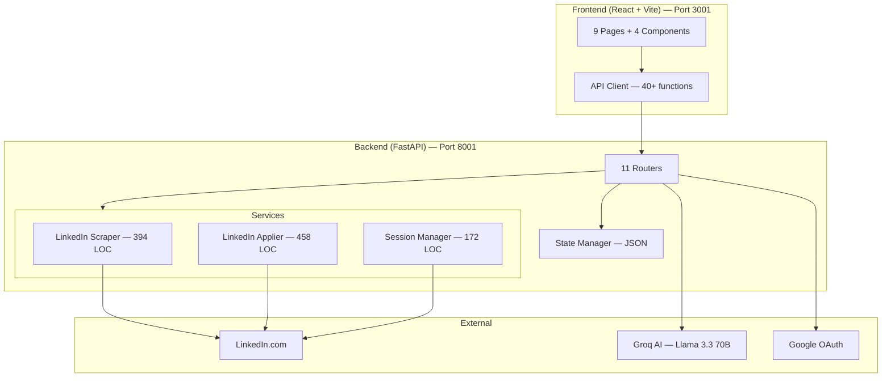

# Jobs Land — Checkpoint 1 Documentation

**Version**: 1.0.0 · **Date**: April 30, 2026 · **Platform**: macOS · **Status**: Production-Ready (Live Mode)

---

## 1. Product Overview

**Jobs Land** is an autonomous LinkedIn job application agent. It connects to your LinkedIn account via Selenium, searches for jobs matching your CV and preferences, scores each job, and auto-submits Easy Apply applications — all running on a 1-hour automated loop.

### Value Proposition
- **Zero manual searching** — the agent discovers jobs for you
- **Zero manual applying** — Easy Apply forms are filled and submitted automatically
- **Smart routing** — non-Easy Apply jobs go to External, unanswerable questions go to Pending Review
- **Answer memory** — once you answer a question, the agent remembers it forever

---

## 2. Architecture

### Tech Stack

| Layer | Technology |
|-------|-----------|
| Frontend | React 18 + Vite 8, react-router-dom, axios, lucide-react |
| Styling | Vanilla CSS — dark theme, glassmorphism |
| Backend | Python 3.12 + FastAPI + Uvicorn |
| Automation | Selenium 4 + Chrome Headless |
| AI Chat | Groq (Llama 3.3 70B) |
| State | `data/state.json` — in-memory cache + file persist |

### Codebase Metrics

| Component | Files | Lines of Code |
|-----------|-------|---------------|
| Frontend (JSX/JS/CSS) | 17 | 2,423 |
| Backend (Python) | 38 | 5,834 |
| Agent module | 16 | 1,434 |
| **Total** | **71** | **~9,700** |

---

## 3. Feature Inventory

### 3.1 Authentication & Profile

| Feature | Status | Details |
|---------|--------|---------|
| Google OAuth login | ✅ Live | Gated entry, stores profile name/photo |
| Apple OAuth login | 🔧 Scaffold | Route exists, no client credentials |
| LinkedIn session (Selenium) | ✅ Live | Chrome profile with cookie persistence |
| Profile display | ✅ Live | Name, title, avatar in sidebar |

### 3.2 CV Management

| Feature | Status |
|---------|--------|
| PDF upload (drag-drop) | ✅ Live |
| Skill extraction (regex) | ✅ Live — 12+ skills extracted |
| Experience years detection | ✅ Live — parses "X years" |
| Summary extraction | ✅ Live — first 500 chars |

### 3.3 AI Chat (Preference Intake)

| Feature | Status |
|---------|--------|
| Guided conversation flow | ✅ Live — greet → country → recency → roles → confirm → ready |
| Groq AI agent (Llama 3.3 70B) | ✅ Live — natural language parsing |
| Deterministic fallback | ✅ Live — regex if AI fails |
| GCC/country/Remote parsing | ✅ Live |
| Role family auto-detection | ✅ Live — "all jobs for me" → 8 role families |

### 3.4 Job Discovery

| Feature | Status |
|---------|--------|
| LinkedIn live search | ✅ Live — Selenium with authenticated session |
| Multi-keyword + multi-country | ✅ Live — searches all role × country combos |
| Easy Apply badge detection | ✅ Live |
| URL verification (HTTP 200) | ✅ Live — all URLs confirmed real |
| Demo mode fallback | ✅ Live — random generation if LinkedIn unavailable |
| Deduplication by job ID | ✅ Live |

### 3.5 Auto-Apply (Easy Apply) — THE CORE FEATURE

| Feature | Status |
|---------|--------|
| SDUI URL navigation | ✅ Live — direct `/apply/?openSDUIApplyFlow=true` |
| Contact info auto-fill | ✅ Live — email, phone from CV/answer bank |
| Resume auto-attachment | ✅ Live — LinkedIn uses previously uploaded resume |
| Radio/checkbox answers | ✅ Live — Yes/No from answer bank |
| Text field auto-fill | ✅ Live — experience years, phone, name |
| Pre-filled select skip | ✅ Live — skips email/phone dropdowns already set |
| Multi-step form walking | ✅ Live — up to 8 steps (Next/Review/Submit) |
| Submission confirmation | ✅ Live — detects modal close |
| Pending question routing | ✅ Live — unknown questions → Pending Review |
| Already-applied detection | ✅ Live — "You applied" text check |
| Rate limiting | ✅ Live — 100/day, 10/hour caps |

### 3.6 Job Routing Logic

| Condition | Action |
|-----------|--------|
| Easy Apply + score ≥ 60% | → Auto-submit application |
| Non-Easy Apply + score ≥ 60% | → External Jobs (manual apply link) |
| Any job + score < 60% | → Skipped |
| Easy Apply + unknown question | → Pending Review |
| Easy Apply + apply error | → Failed (with error logged) |

### 3.7 UI Pages (9 total)

| Page | Route | Purpose |
|------|-------|---------|
| Welcome/Login | `/` | Landing with Google/Apple auth |
| Dashboard | `/` (auth'd) | Stats, Run Automation, live log window |
| Job Explorer | `/jobs` | Browse/filter jobs by status |
| Chat | `/chat` | AI preference setup |
| CV Upload | `/cv` | PDF upload with skill preview |
| Settings | `/settings` | LinkedIn, live mode, AI config, diagnostics |
| Pending Review | `/pending` | Answer unknown form questions |
| Answer Memory | `/answers` | View/edit saved Q&A bank |
| Application History | `/history` | Track submitted applications |

---

## 4. API Reference (30+ endpoints)

| Method | Endpoint | Purpose |
|--------|----------|---------|
| GET | `/health` | Health check |
| GET | `/dashboard/stats` | All counters and status |
| GET | `/settings/live-mode` | Live mode + session state |
| PUT | `/settings/live-mode` | Toggle live/demo |
| GET | `/settings/linkedin-session` | Session validity |
| POST | `/settings/linkedin-session/open` | Chrome login window |
| POST | `/settings/linkedin-session/verify` | Verify cookies |
| DELETE | `/settings/linkedin-session` | Clear session |
| GET | `/profile/` | User profile data |
| GET | `/profile/status` | Auth connection status |
| POST | `/profile/google/connect` | Google OAuth |
| GET | `/cv/` | CV metadata + skills |
| POST | `/cv/upload` | Upload PDF |
| DELETE | `/cv/` | Remove CV |
| GET | `/chat/` | Chat history + preferences |
| POST | `/chat/` | Send message or reset |
| GET | `/jobs/` | All jobs |
| GET | `/jobs/applied` | Applied jobs |
| GET | `/jobs/pending` | Pending review |
| GET | `/jobs/external` | External apply |
| POST | `/jobs/{id}/answer` | Answer pending question |
| GET | `/automation/status` | Engine state + caps |
| POST | `/automation/start` | Start engine |
| POST | `/automation/stop` | Stop engine |
| POST | `/automation/clear-jobs` | Reset job data |
| GET | `/automation/runs` | Run history |
| GET | `/automation/logs` | SSE log stream |
| GET | `/automation/logs/poll` | Poll-based logs |
| GET/POST/DELETE | `/answers/` | Answer bank CRUD |
| GET | `/linkedin/diagnose` | System diagnostics |
| POST | `/linkedin/test-search` | Debug search |
| POST | `/linkedin/test-apply` | Debug apply |

---

## 5. What Is REAL vs DEMO vs POC

### ✅ Fully Production (Live & Verified)

| Component | Evidence |
|-----------|----------|
| LinkedIn job discovery | 60 real jobs, 40+ companies, all URLs HTTP 200 |
| Easy Apply submission | 2 verified submissions (Altis Technology, Socium) |
| CV parsing | Real PDF, 12 skills + 15 years extracted |
| AI Chat | Groq Llama 3.3 70B with fallback |
| Answer bank | 34 answers, fuzzy matching, persistent |
| Session management | macOS Keychain cookie integration |
| Automation loop | 1-hour scheduler, background thread |

### 🟡 Demo/Fallback (Present but secondary)

| Component | When Active |
|-----------|-------------|
| Simulated job discovery | `live_mode=false` or no LinkedIn session |
| Simulated apply | Demo mode only — random outcomes |
| Fake URLs | Demo mode only — hash-based IDs |

### 🔴 POC / Not Implemented

| Component | Status |
|-----------|--------|
| Apple OAuth | Scaffold only |
| Indeed/Bayt/GulfTalent scrapers | UI shows sources, no implementations |
| Semantic job scoring | Uses keyword overlap, not embeddings |
| Email/Telegram notifications | Not built |
| Resume tailoring per job | Not built |
| Cover letter generation | Not built |
| Proxy/fingerprint rotation | Not built |
| Unit/integration tests | Zero tests |
| SQLite database | Config exists but unused |

---

## 6. Key Technical Decisions

| Decision | Rationale |
|----------|-----------|
| **Chrome profile copy-to-temp** | macOS Keychain encrypts cookies; copying avoids lock conflicts |
| **SDUI direct URL navigation** | LinkedIn 2026 obfuscated all CSS classes; `/apply/` URL renders form inline |
| **Label text cleaning** | SDUI duplicates labels: `"Q?\nQ?\nRequired"` → extract first line |
| **One driver per apply** | Prevents memory leaks and cookie state bleed |
| **JSON state file** | Simple, debuggable, no ORM; adequate for single-user local app |
| **Groq + deterministic fallback** | AI for natural chat, regex fallback for reliability |

---

## 7. Recommendations (Prioritized)

### Priority 1: Reliability
- [ ] Retry failed applies (currently 0 retries)
- [ ] Reuse driver across applies within a cycle (5x speed improvement)
- [ ] Screenshot on failure for debugging
- [ ] Auto-refresh LinkedIn cookies on expiry

### Priority 2: Intelligence
- [ ] Semantic scoring with sentence-transformers (replace keyword overlap)
- [ ] Filter irrelevant jobs ("Architectural Engineer" shouldn't match AI leader)
- [ ] Learn from user skip/apply patterns

### Priority 3: Scale
- [ ] Migrate JSON → SQLite for concurrent safety
- [ ] Proxy rotation for LinkedIn anti-bot
- [ ] Implement Indeed/GulfTalent scrapers
- [ ] Email/Telegram notifications

### Priority 4: Polish
- [ ] Unit tests for scraper, applier, scoring
- [ ] Mobile-responsive UI
- [ ] AI cover letter generation
- [ ] Resume tailoring per job description

---

## 8. Verified Test Results

| Test | Result | Date |
|------|--------|------|
| LinkedIn live search | ✅ 60 real jobs, 40 companies | Apr 30, 2026 |
| URL verification | ✅ All 60 return HTTP 200 | Apr 30, 2026 |
| Easy Apply — Altis Technology | ✅ SUBMITTED | Apr 30, 2026 |
| Easy Apply — Socium | ✅ SUBMITTED | Apr 30, 2026 |
| Phone auto-fill | ✅ Working | Apr 30, 2026 |
| Radio button answers | ✅ Working (hybrid, commute) | Apr 30, 2026 |
| Pre-filled select skip | ✅ Working (email, phone code) | Apr 30, 2026 |
| Multi-step form walk | ✅ Contact→Resume→Questions→Submit | Apr 30, 2026 |
| Answer bank matching | ✅ 34 answers, fuzzy match | Apr 30, 2026 |

---

*Checkpoint 1 — Jobs Land v1.0.0 — April 30, 2026*
